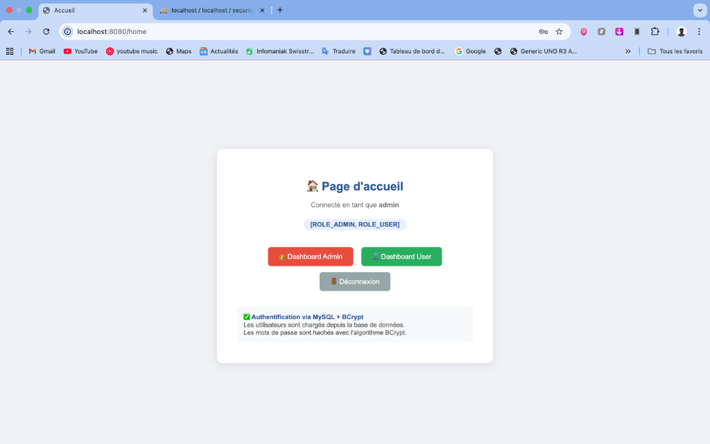
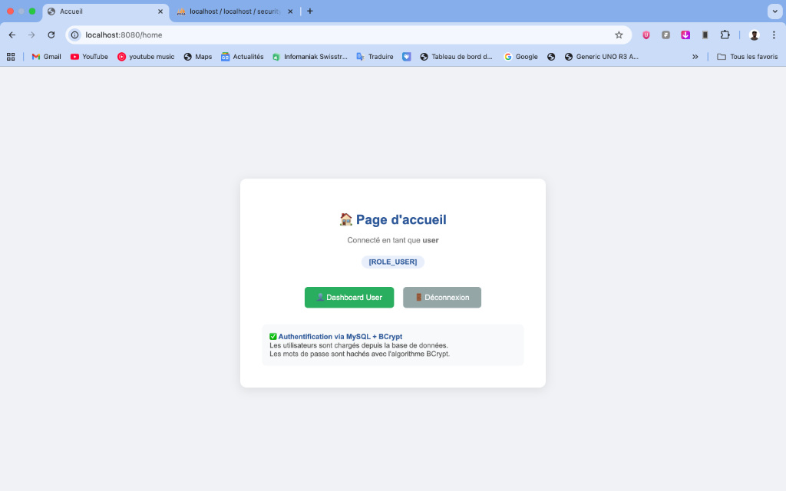
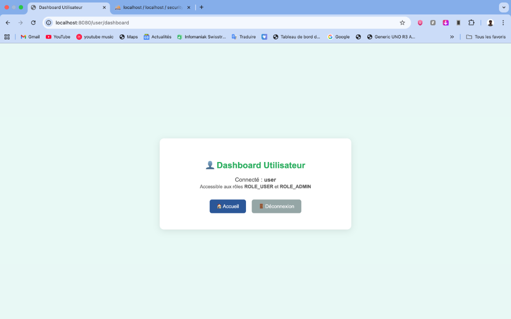
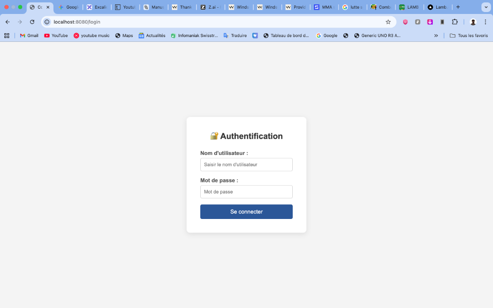

# TP-11-Authentification-JDBC-JPA

Ce projet est une démonstration complète de l'implémentation de **Spring Security 6** avec **Spring Data JPA**, une base de données **MySQL** et le hachage de mots de passe **BCrypt**.

## 📸 Aperçu du projet

| Page de Connexion | Page d'Accueil (Admin) |
| :---: | :---: |
|  |  |

| Dashboard Admin | Dashboard Utilisateur |
| :---: | :---: |
|  |  |

| Page d'Accueil (User) | Notification Déconnexion |
| :---: | :---: |
|  |  |

## 🚀 Fonctionnalités

- **Authentification personnalisée** via une base de données.
- **Gestion des rôles** (RBAC) avec les rôles `ROLE_ADMIN` et `ROLE_USER`.
- **Hachage sécurisé** des mots de passe avec l'algorithme BCrypt.
- **Interface Web** simple avec Thymeleaf.
- **Initialisation automatique** de la base de données au démarrage.

## 🛠️ Technologies utilisées

- **Java 17**
- **Spring Boot 3.2.0**
- **Spring Security 6**
- **Spring Data JPA**
- **MySQL**
- **Thymeleaf**
- **Maven**

## 📋 Prérequis

- JDK 17 ou supérieur.
- MySQL Server installé et en cours d'exécution.
- Maven.

## ⚙️ Configuration

1. Créez une base de données nommée `security_db` dans MySQL.
2. Modifiez le fichier `src/main/resources/application.properties` si nécessaire pour ajuster vos identifiants MySQL :

```properties
spring.datasource.url=jdbc:mysql://localhost:3306/security_db
spring.datasource.username=votre_utilisateur
spring.datasource.password=votre_mot_de_pass
```

## 🏃 Lancement

Utilisez la commande Maven suivante pour lancer l'application :

```bash
mvn spring-boot:run
```

## 🔐 Identifiants par défaut

Au premier démarrage, la base de données est initialisée avec les comptes suivants :

| Utilisateur | Mot de passe | Rôles |
| :--- | :--- | :--- |
| `admin` | `1234` | `ROLE_ADMIN`, `ROLE_USER` |
| `user` | `1111` | `ROLE_USER` |

## 📂 Structure du projet

- `src/main/java/ma/fstg/security/config` : Configuration de la sécurité et initialisation.
- `src/main/java/ma/fstg/security/entities` : Entités JPA (`User`, `Role`).
- `src/main/java/ma/fstg/security/repositories` : Interfaces de dépôt Spring Data.
- `src/main/java/ma/fstg/security/services` : Implémentation de `UserDetailsService`.
- `src/main/java/ma/fstg/security/web` : Contrôleurs Web.
- `src/main/resources/templates` : Pages HTML (Thymeleaf).

## 🛡️ Règles de sécurité

- `/login`, `/register` : Accès public.
- `/admin/**` : Réservé aux administrateurs (`ROLE_ADMIN`).
- `/user/**` : Accessible aux utilisateurs et administrateurs.
- Toutes les autres routes nécessitent une authentification.
